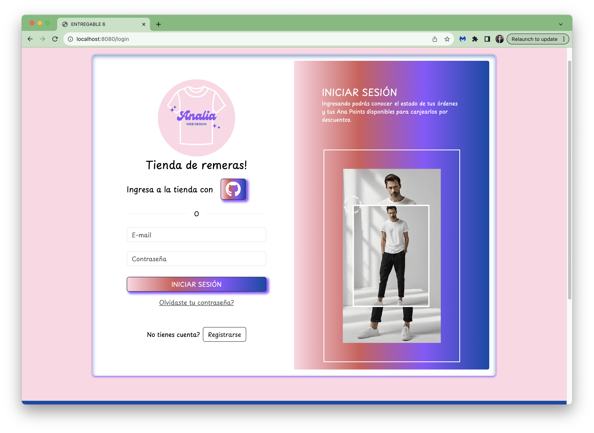
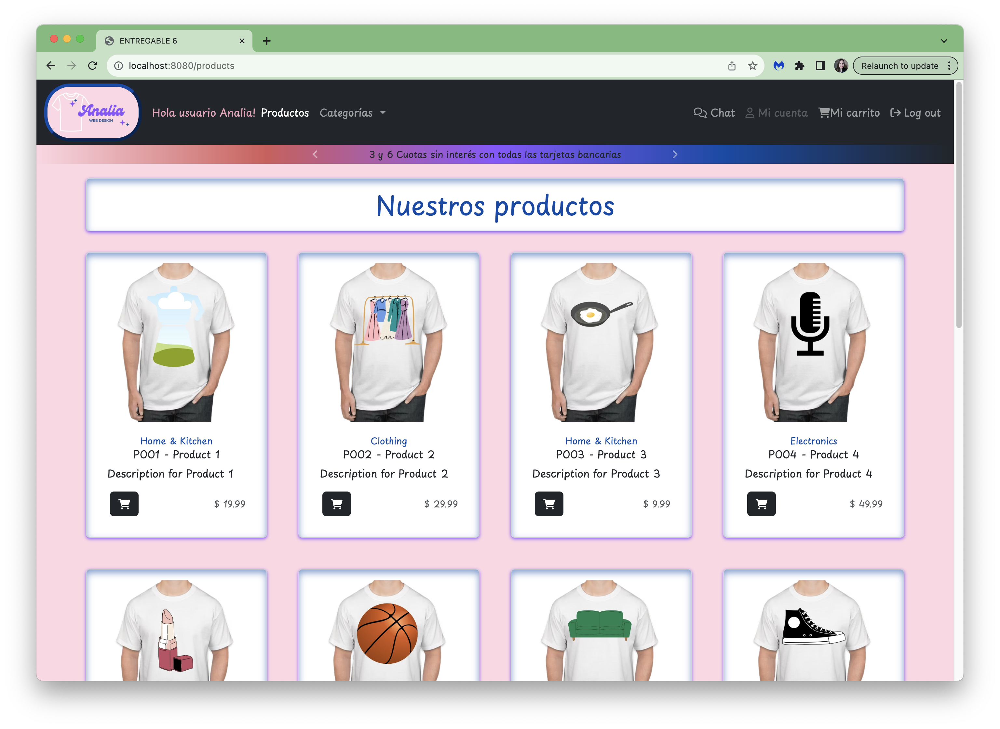

# E-commerce con node.js, MongoDB, Express y handlebars - Tu tienda de remeras

## Introducción:
Este trabajo se realizó como proyecto final del curso de Desarrollo Backend de Coderhouse.
Se programó el servidor de un e-commerce, utilizando server-side rendering como frontend

<div style="display: flex">


</div>

## Datos generales:

### Sobre la alumna
- Nombre: Analía Acosta
- [LinkedIn](https://www.linkedin.com/in/analia-acosta-engineer/)
- [Porfolio](https://portfolio-analia.vercel.app/)
- [GitHub](https://github.com/analiaacosta2023/)

### Sobre el curso
- Desarrollo Backend - Coderhouse
- Comisión: 55535
- Profesor: Matías Camusso
- Tutor: Nicolás Mariano Ramos

## Deploy
Se puede visualizar e interactuar con la aplicación desde el [link](https://backend55535-pf-analiaacosta-production.up.railway.app/). ***(No realizado todavía)***

## Como correr el proyecto localmente
1. Clonar el repositorio.
2. Configurar las variables de entorno.
3. En el directorio del proyecto, instalar las dependencias:
```bash
npm install
```
4. Luego levantar el servidor:
```bash
npm run start
```
5. Abrir http://localhost:8080 para visualizar en el navegador.

## Recorrido por la tienda

### Inicio
En *inicio*, visualizamos el botón *Iniciar sesión* que nos redirige al login, y el botón *Registrate* que nos redirige al formulario de registro.
Desde *login*, podemos ingresar a la tienda mediante autenticación de terceros con GitHub, o bien ingresar usuario y contraseña. También están disponibles las opciones *Olvidaste tu contraseña?* y *No tienes cuenta?*
Ademas de ingresar y registrarse, se puede *cambiar la contraseña* en caso de que haya sido olvidada. Se envía un link al email del usuario con el cual puede cambiar su contraseña dentro del lapso de 1 hora, dado que esto se realiza con un token que expira.

### Productos
Los usuarios logueados son redirigidos al shop, donde se muestran los distintos *productos*, se puede filtrar por *categorías* en la navbar y agregar productos al *carrito*. También en la barra de navegación se puede acceder a las funcionalidades *Chat*, *Mi carrito* y *Log Out*.

### Carrito
Se puede abrir el *carrito* desde la barra de navegación.
En caso de no existir productos cargados, se notificará.
Pero de existir productos en él, se podrá borrar ítems, modificar cantidad, agregar el envío o hacer el *checkout*.

### Checkout
Presionando en *checkout*, se genera una orden de compra luego de verificar el stock de los productos. En caso de existir faltante, ese producto continuará en el carrito y se generará la orden solo con los productos que si tienen stock.

### Vistas para el admin
Tambien existen dos vistas, exclusivas para uso del administrador, *Gestionar productos* donde se pueden agregar y borrar productos, y *Usuarios* donde se puede visualizar la lista de usuarios y modificarla.

<div align="right">Fin del recorrido.</div>

## Sobre la API
La documentación de la API se realizó con Swagger y se puede visualizar desde el endpoint **'/api/docs'**
A continuación, se describe brevemente los endpoints principales.

### Router Carts 
- **POST '/api/carts'** crea carrito.
- **GET '/api/carts/:cid'** obtiene un carrito.
- **POST '/api/carts/:cid/product/:pid'** agrega un producto al carrito.
- **DELETE '/api/carts/:cid/product/:pid'** quita un producto del carrito.
- **PUT '/api/carts/:cid'** modifica todos los productos del carrito.
- **PUT '/api/carts/:cid/product/:pid'** modifica la cantidad de un producto.
- **DELETE '/api/carts/:cid'** limpia el carrito.
- **POST '/api/carts/:cid/purchase'** genera orden de compra con verificación de stock y envío de email con confirmación.

### Router Messages
- **GET '/api/messages'** obtiene todos los mensajes del chat.
- **POST '/api/messages'** guarda un mensaje nuevo.

### Router Products
- **GET '/api/products'** obtiene todos los productos.
- **GET '/api/products/:pid'** obtiene un producto.
- **POST '/api/products'** crea un producto.
- **PUT '/api/products/:pid'** modifica un producto.
- **DELETE '/api/products/:pid'** elimina un producto.

### Router Sessions
- **POST '/api/sessions/login'** para iniciar sesión.
- **GET '/api/sessions/github'** para iniciar autenticación por terceros con github.
- **POST '/api/sessions/register'** para enviar el formulario de registro.
- **GET '/api/sessions/logout'** para finalizar la sesión.
- **POST '/api/sessions/resetPassword'** para enviar email de recuperación de contraseña.
- **PUT '/api/sessions/restartPassword'** para modificar la contraseña.
- **GET '/api/sessions/current'** para obtener el usuario logueado desde el token JWT almacenado en el navegador.

### Router Users
- **GET '/api/users/'** para obtener todos los usuarios.
- **DELETE '/api/users/'** para eliminar los usuarios con 2 días de inactividad.
- **GET '/api/users/:uid'** para obtener los datos de un usuario.
- **DELETE '/api/users/:uid'** para eliminar un usuario.
- **PUT '/api/users/premium/:uid** para modificar el rol de un usuario.
- **POST '/api/users/:uid/documents'** para cargar documentos. Ver ejemplo de como cargar un documento con postman en la carpeta *postman*.

### Router Views
- **GET '/'** Vista home page.
- **GET '/realtimeproducts'** Vista para agregar y borrar productos.
- **GET '/chat'** Vista del chat.
- **GET '/products'** Vista de todos los productos.
- **GET '/products/:pid'** Vista de un producto.
- **GET '/carts/:cid'** Vista de un carrito.
- **GET '/login'** Formulario del login.
- **GET '/register'** Formulario de registro.
- **GET '/resetpassword'** Vista para enviar email de recuperación de contraseña.
- **GET '/restartpassword/:token'** Vista para cambiar contraseña.
- **GET '/restartpassword'** Vista para cuando el token de recuperación ha expirado.
- **GET '/users'** Vista con la lista de usuarios.

## Base de datos
Se utilizó la base de datos [MongoDB](https://www.mongodb.com/)

## Librerías externas utilizadas
- **[Faker](https://fakerjs.dev/api/)** para crear mocks.
- **[Bcrypt](https://www.npmjs.com/package/bcrypt)** para hashear contraseñas.
- **[Cookie Parser](https://www.npmjs.com/package/cookie-parser)** para gestionar cookies.
- **[Dotenv](https://www.npmjs.com/package/dotenv)** para gestionar variables de entorno.
- **[Express](https://expressjs.com/es/)** para la infraestructura de la API.
- **[Handlebars](https://handlebarsjs.com/)** para server side rendering.
- **[Json Web Token](https://jwt.io/)** y **[Passport](https://www.passportjs.org/)** para autenticación.
- **[Mongoose](https://mongoosejs.com/)** para gestionar la base de datos.
- **[Multer]()** para cargar documentos.
- **[Node Mailer](https://nodemailer.com/)** para envío de emails.
- **[Passport]()** para autenticación.
- **[Socket.io](https://socket.io/)** para el chat.
- **[Swagger](https://swagger.io/)** para la documentación de la API.
- **[Winston](https://www.npmjs.com/package/winston)** para los logs.
- **[Chai]()**, **[Mocha]()** y **[Supertest]()** para testing.